# 📊 Product Funnel & Cohort Performance Analytics
**Tech Stack:** Microsoft Excel • MySQL • SQL • Power BI • DAX • GitHub


## Dashboard Preview

### Executive Overview

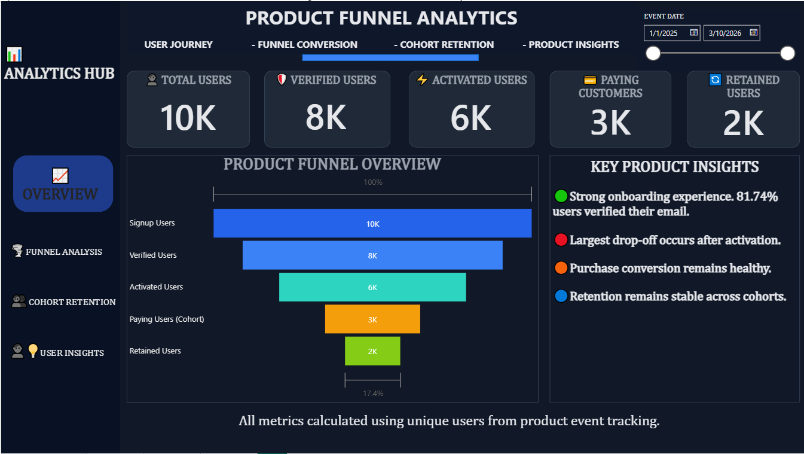

### Funnel Analysis

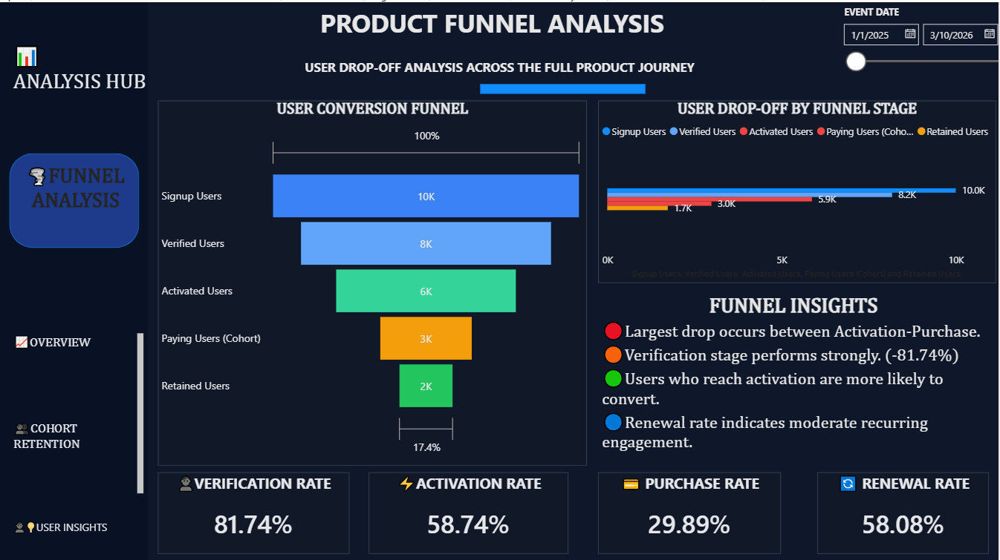

### Cohort Performance

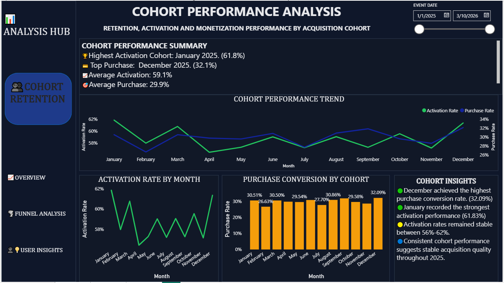

## Executive Summary

Understanding how users progress from signup to becoming paying customers is essential for measuring product success and identifying opportunities to improve user adoption. Businesses rely on funnel and cohort analysis to uncover friction within the customer journey, evaluate onboarding effectiveness, and optimize long-term customer retention.

This project presents an end-to-end Product Funnel and Cohort Performance Analysis using **Microsoft Excel, MySQL, and Power BI**. Beginning with raw event-level data, the project follows users through each stage of the product lifecycle—from signup and email verification to product activation, purchase, and renewal.

The project combines data cleaning, SQL validation, cohort analysis, dashboard development, and business storytelling to transform raw behavioural data into actionable insights that support product growth and data-driven decision-making.

---

# Business Problem

A SaaS company wants to understand how users move through its onboarding funnel and identify where potential customers disengage before becoming paying users.

The business also wants to compare user behaviour across different signup cohorts to determine whether acquisition quality changes over time and identify the periods associated with stronger customer engagement and monetization.

To support these objectives, the analysis answers the following questions:

* How many users progress through each stage of the product funnel?
* Where do the largest customer drop-offs occur?
* What are the verification, activation, purchase, and renewal conversion rates?
* Which signup cohorts demonstrate the strongest activation and purchase performance?
* What business actions can improve user conversion and long-term retention?

---

# Project Objectives

The primary objectives of this project are to:

* Measure user progression through the product funnel.
* Calculate conversion rates between key onboarding stages.
* Identify the largest areas of user drop-off.
* Evaluate cohort performance across monthly signup groups.
* Produce executive dashboards that communicate product performance effectively.
* Generate actionable recommendations to improve user activation and business growth.

---

# Tools Used

| Tool                | Purpose                                                                      |
| ------------------- | ---------------------------------------------------------------------------- |
| **Microsoft Excel** | Data cleaning, date formatting, preprocessing and preparation for SQL import |
| **MySQL Workbench** | Data validation, SQL analysis, business question analysis                    |
| **Power BI**        | Interactive dashboard development and executive reporting                    |
| **DAX**             | KPI calculations and analytical measures                                     |
| **GitHub**          | Project documentation and portfolio presentation                             |

---

# Dataset Overview

The project consists of three related datasets representing different stages of the customer journey.

## Users

Contains user profile information including:

* User ID
* Signup Date
* Acquisition Channel
* Device Type
* Country

The Users table served as the primary user dimension after data validation and duplicate investigation.

---

## Events

Contains user interactions throughout the onboarding journey.

Examples include:

* Signup
* Email Verification
* First Product Use
* Renewal

This table forms the foundation of the funnel and cohort analysis.

---

## Purchases

Contains completed purchase transactions including:

* User ID
* Purchase Date
* Revenue
* Payment Information

This dataset was used to evaluate monetization performance and purchase behaviour.

---

# Data Preparation

Before importing the datasets into MySQL, Microsoft Excel was used to prepare the data for analysis.

Preparation included:

* Formatting dates into SQL-compatible formats.
* Separating date and time fields where required.
* Performing preliminary quality checks.
* Standardizing column formats.
* Preparing clean CSV files for successful database import.

Although these tasks are often overlooked, proper preprocessing significantly reduces import errors and ensures consistency throughout the analytical workflow.

---

# Data Validation & Quality Assessment

Before performing any analysis, the datasets were validated to ensure reliable reporting.

Validation included:

* Total row count verification.
* Distinct user count verification.
* Duplicate detection.
* Missing User ID checks.
* Event completeness validation.
* Purchase validation.
* Date range verification.
* Cross-table consistency checks.

---

# Duplicate User Investigation

One of the most important discoveries during validation was an inconsistency between the Users and Events datasets.

Initial validation returned:

| Dataset | Distinct Users |
| ------- | -------------: |
| Users   |          9,539 |
| Events  |         10,000 |

Further investigation revealed duplicate user records within the Users dataset.

SQL validation confirmed:

* Duplicate User IDs existed.
* No missing User IDs were identified.
* Event records tracked 10,000 users.
* Duplicate records inflated the Users table.

To ensure reliable reporting, duplicate records were removed, resulting in a cleaned Users table containing **7,608 unique users**.

Rather than ignoring the discrepancy, the issue was investigated and documented, reinforcing the importance of validating source data before calculating business KPIs.

---

# SQL Environment Setup

Following data preparation, the datasets were imported into MySQL Workbench.

The SQL workflow consisted of:

1. Creating a dedicated project database.
2. Importing CSV datasets.
3. Validating successful imports.
4. Investigating data quality.
5. Performing exploratory SQL analysis.
6. Building business-focused analytical queries.
7. Validating KPIs before dashboard development.

---

# Project Workflow

The project followed the following analytical workflow:

```text
Business Understanding
        ↓
Data Preparation (Excel)
        ↓
Data Validation (SQL)
        ↓
Data Cleaning
        ↓
Exploratory SQL Analysis
        ↓
Funnel Analysis
        ↓
Conversion Analysis
        ↓
Cohort Performance Analysis
        ↓
Business Insights
        ↓
Power BI Dashboard Development
        ↓
Executive Recommendations
```

# SQL Analysis

Before developing the Power BI dashboard, SQL was used to validate the integrity of the datasets, investigate data quality issues, answer key business questions, and calculate the performance metrics used throughout the project.

Rather than immediately creating visualizations, the project followed an **analysis-first approach**, ensuring every KPI presented in the dashboard was supported by validated SQL outputs. This process also helped identify data inconsistencies before reporting business insights.

---

# Data Validation

The first stage focused on verifying the quality and reliability of the imported datasets.

Validation checks included:

* Total row count verification
* Distinct user count validation
* Duplicate user detection
* Missing User ID checks
* Event completeness validation
* Purchase data verification
* Date range validation
* Cross-table consistency checks

These checks ensured that subsequent analyses were based on accurate and trustworthy data.

---

# Duplicate User Investigation

During the validation process, an unexpected discrepancy was identified between the Users and Events tables.

Initial validation returned:

| Dataset | Distinct Users |
| ------- | -------------: |
| Users   |          9,539 |
| Events  |         10,000 |

Further investigation revealed duplicate User IDs within the Users table, which artificially inflated the total user count.

Additional SQL validation confirmed:

* Duplicate User IDs existed.
* No missing User IDs were detected.
* Event records tracked 10,000 users.
* Duplicate records inflated the Users dataset.

To maintain analytical accuracy, duplicate user records were removed, resulting in a cleaned Users table containing **7,608 unique users**.

This step ensured that the user dimension used for modelling represented verified users rather than duplicated records.

---

# Product Funnel Analysis

The product funnel was analysed to measure user progression through the onboarding journey.

The following stages were evaluated:

* Signup
* Email Verification
* First Product Use
* Purchase
* Renewal

Each stage was calculated using **distinct user counts** to avoid inflating metrics through repeated event records.

The funnel analysis provided a clear view of where users progressed successfully and where significant drop-offs occurred.

### Validated Funnel Results

| Funnel Stage       |  Users |
| ------------------ | -----: |
| Signup             |  7,608 |
| Email Verification | 8,174* |
| First Product Use  |  5,874 |
| Purchase           |  2,989 |
| Renewal            |  1,736 |

> **Note:** The Email Verification count exceeded the cleaned Signup count because the Events table contained user records outside the validated Users dimension. Rather than excluding this discrepancy, it was investigated, documented, and considered during the interpretation of business metrics.

---

## SQL Screenshot — Funnel Analysis

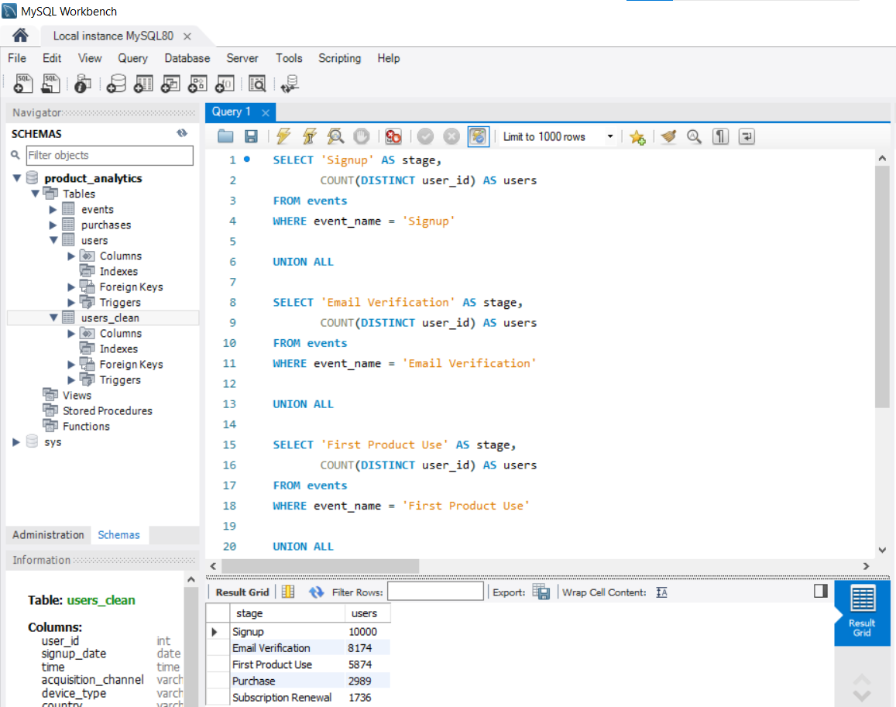
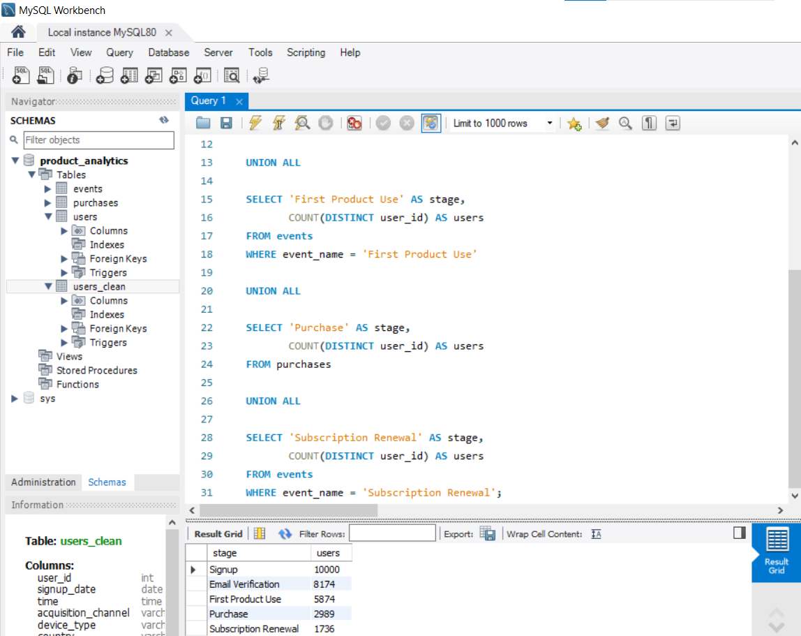

`SQL_Funnel_Analysis.png`

This query was used to calculate the number of unique users progressing through each stage of the onboarding funnel.

---

# Funnel Drop-off Analysis

Understanding where users abandon the onboarding journey is essential for improving product adoption.

SQL was used to compare user counts between consecutive funnel stages, allowing the identification of the largest conversion losses.

The analysis showed that the most significant decline occurred before users reached their first product interaction, highlighting onboarding as the primary opportunity for product optimization.

This insight provides a strong foundation for improving activation strategies and reducing customer abandonment.

---

## SQL Screenshot — Drop-off Analysis

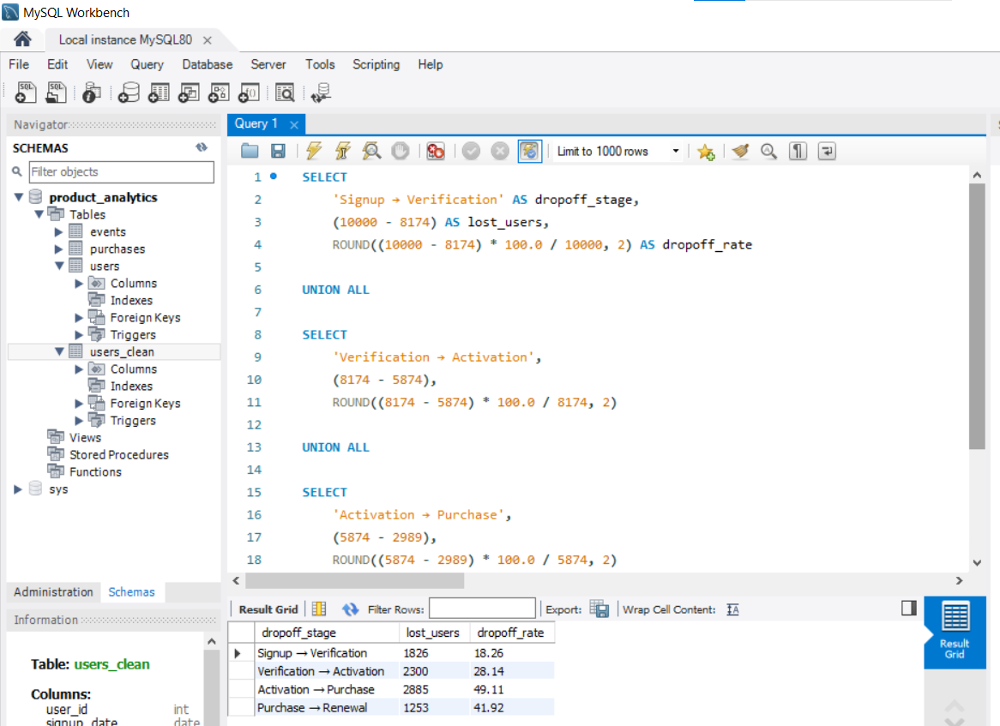
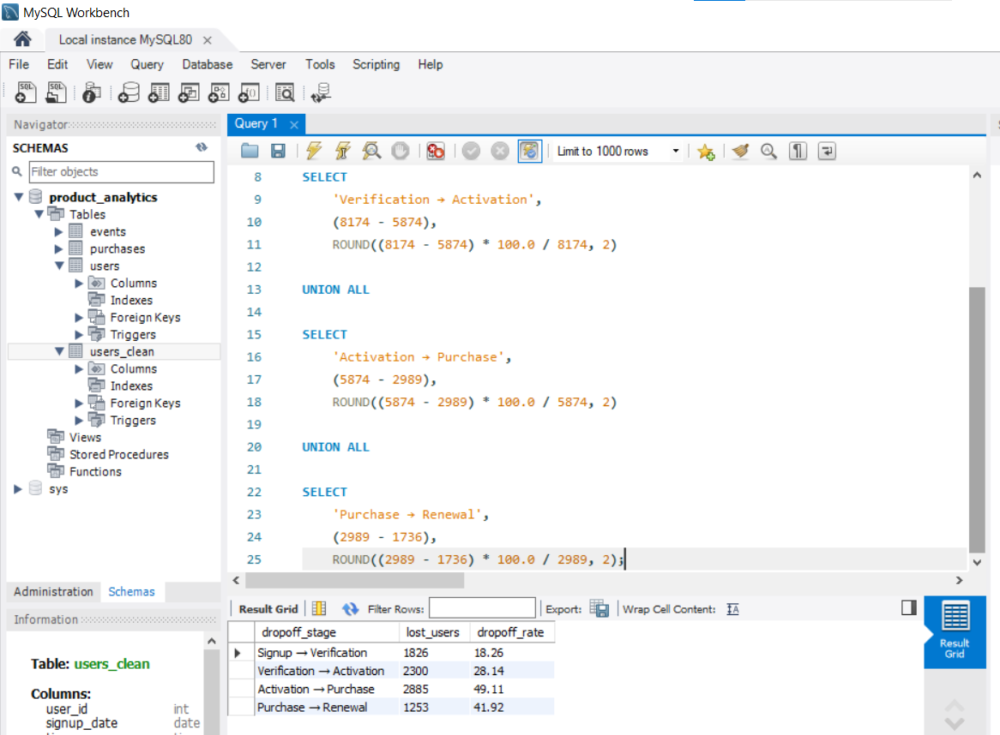

`SQL_Dropoff_Analysis.png`

This query identifies the largest user losses across the onboarding funnel and supports the product optimization recommendations presented later in the project.

---

# Conversion Rate Analysis

To evaluate onboarding effectiveness, SQL was used to calculate conversion rates between the major stages of the product funnel.

All conversion rates were calculated using **distinct user counts**, ensuring that repeated events did not inflate business KPIs.

The analysis focused on measuring how efficiently users progressed from Signup to Product Activation and ultimately to becoming Paying Customers.

The SQL calculations later served as the benchmark for validating Power BI DAX measures, ensuring consistency between both analytical environments.

---

## SQL Screenshot — Cohort Conversion Analysis

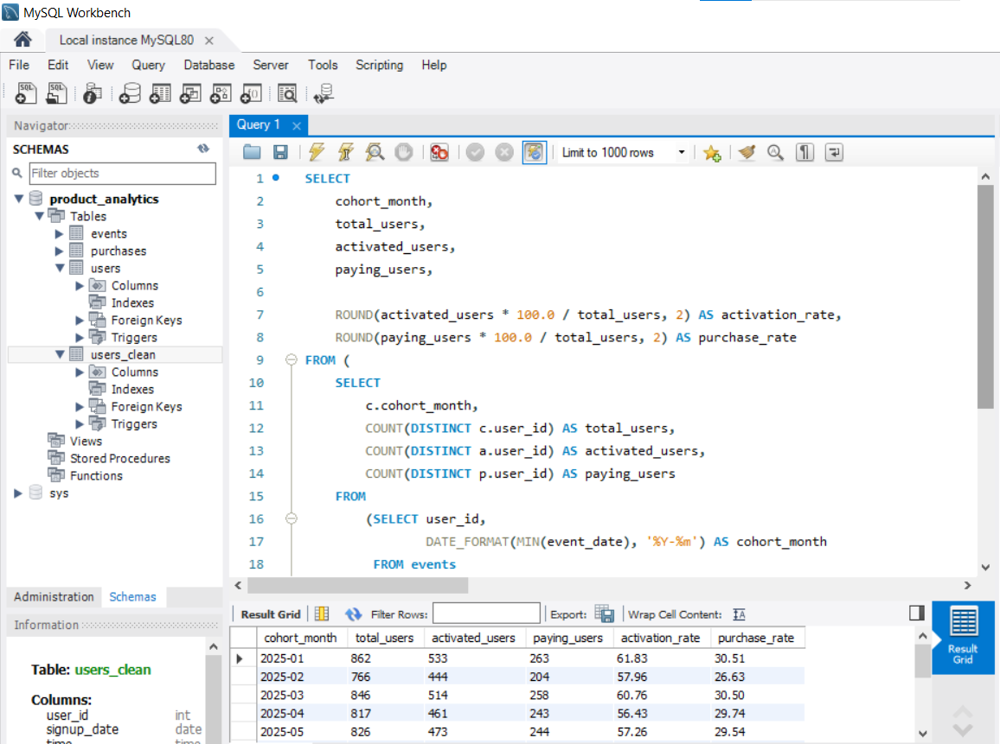
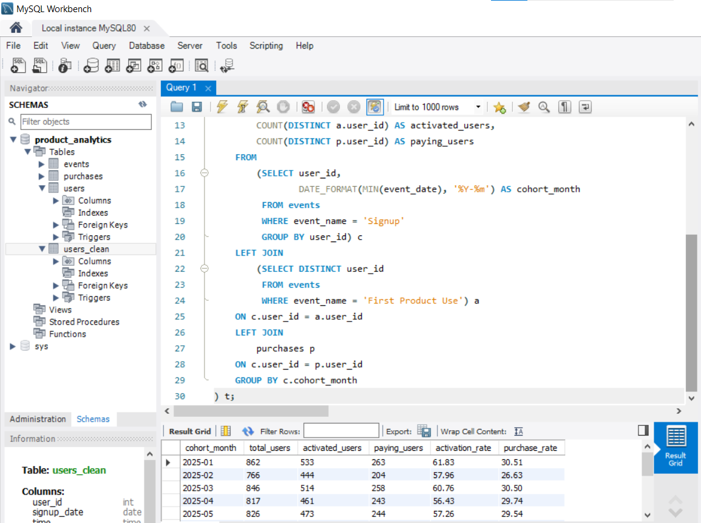

`SQL_Cohort_Conversion.png`

This SQL query calculates activation and purchase conversion rates for each monthly signup cohort, enabling performance comparisons across the year.

---

# Cohort Performance Analysis

A monthly cohort analysis was conducted to evaluate whether users who joined during different months behaved differently throughout the onboarding process.

Each cohort was analysed using five key performance metrics:

* Signup Users
* Activated Users
* Paying Users
* Activation Rate
* Purchase Rate

Unlike traditional monthly reporting, cohort analysis groups users based on their signup month, allowing long-term onboarding performance to be evaluated more accurately.

### Cohort Performance Summary

| Cohort    | Activation Rate | Purchase Rate |
| --------- | --------------: | ------------: |
| January   |          61.83% |        30.51% |
| February  |          57.96% |        26.63% |
| March     |          60.76% |        30.50% |
| April     |          56.43% |        29.74% |
| May       |          57.26% |        29.54% |
| June      |          59.02% |        30.80% |
| July      |          57.19% |        27.70% |
| August    |          59.05% |        30.86% |
| September |          57.26% |        31.82% |
| October   |          59.54% |        29.58% |
| November  |          57.14% |        28.57% |
| December  |          61.34% |        32.09% |

The results indicate relatively stable onboarding performance throughout the year, with January recording the strongest activation rate and December achieving the highest purchase conversion.

---

# Executive Summary Query

To support executive decision-making, SQL was also used to generate a high-level summary of the project's key KPIs.

The executive summary consolidated the most important business metrics into a single query, enabling stakeholders to quickly assess overall product performance without reviewing multiple analyses.

---

## SQL Screenshot — Executive Summary

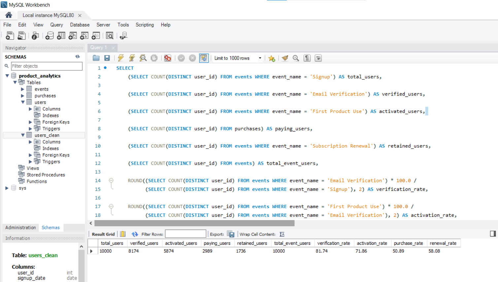
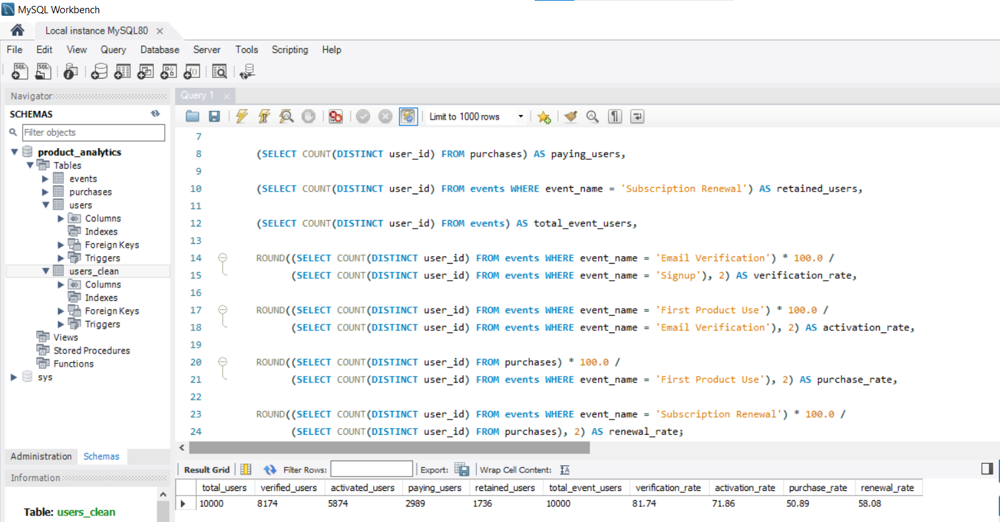

`SQL_Executive_Summary.png`

This query summarizes the primary KPIs used throughout the project and serves as the foundation for the Executive Overview dashboard in Power BI.

---

# Key SQL Insights

The SQL analysis produced several important business findings:

* The largest user drop-off occurred between **Signup** and **First Product Use**, highlighting onboarding as the greatest opportunity for improvement.
* Activation performance remained relatively consistent across all cohorts, ranging from **56.43%** to **61.83%**.
* The **December cohort** achieved the highest purchase conversion rate (**32.09%**), suggesting stronger monetization performance than earlier cohorts.
* The **January cohort** recorded the highest activation performance (**61.83%**), indicating particularly effective onboarding during that acquisition period.
* Investigating duplicate user records before analysis prevented inflated user counts and reinforced the importance of data validation as a prerequisite for trustworthy business reporting.

These validated SQL findings formed the analytical foundation for the Power BI dashboard and the executive recommendations presented in the final section of the project.

# Power BI Dashboard

After validating the datasets and completing the SQL analysis, the findings were transformed into an interactive Power BI dashboard designed for executive reporting and business decision-making.

The dashboard was developed to communicate user behaviour, funnel performance, cohort trends, and conversion metrics in a clear, visually engaging format. Every KPI displayed within the report was first validated using SQL before being implemented with DAX, ensuring consistency between both analytical environments.

The report consists of three analytical pages.

---

# Dashboard Overview

## Page 1 – Executive Overview

The Executive Overview page provides a high-level summary of product performance, allowing stakeholders to understand the overall health of the onboarding funnel at a glance.

### Dashboard Components

**KPI Cards**

* Total Signups
* Verified Users
* Activated Users
* Paying Users
* Renewal Users

**Visualizations**

* Funnel Performance Chart
* Executive Insight Panel

### Business Value

This page enables executives and product managers to quickly assess user progression through the onboarding journey while identifying areas requiring immediate attention.

### Dashboard Preview
Dashboard preview shown above.

---

## Page 2 – Funnel Analysis

This page focuses on understanding how users move through each stage of the onboarding process and identifying where customer losses occur.

### Dashboard Components

**Visualizations**

* Funnel Analysis
* User Drop-off Analysis
* Funnel KPI Summary
* Business Insight Panel

### Business Value

The analysis highlights the stages contributing most to user abandonment, helping product teams prioritize onboarding improvements that increase activation and customer conversion.

### Dashboard Preview
Dashboard preview shown above.


---

## Page 3 – Cohort Performance Analysis

The final dashboard evaluates the quality of monthly signup cohorts by comparing activation performance and purchase conversion over time.

### Dashboard Components

**Visualizations**

* Cohort Performance Trend
* Activation Rate by Cohort
* Purchase Conversion by Cohort
* Cohort Insight Panel

### Business Value

Rather than viewing all users as a single population, cohort analysis enables decision-makers to evaluate acquisition quality across different signup periods and identify months associated with stronger customer engagement and monetization.

### Dashboard Preview

Dashboard preview shown above.


---

# Data Modelling

A relational data model was developed in Power BI using the cleaned Users table as the primary dimension, connected to the Events and Purchases tables through **User ID**.

This structure enabled consistent filtering across datasets and ensured that SQL-derived KPIs could be accurately reproduced using DAX.

To align Power BI with the SQL cohort analysis, a calculated **Cohort Month** field was created based on each user's earliest recorded event. This ensured that cohort reporting reflected users' signup periods rather than individual event dates.

---

# DAX Measures

Custom DAX measures were created to calculate the KPIs displayed throughout the dashboard.

Examples include:

* Total Signups
* Verified Users
* Activated Users
* Paying Users
* Renewal Users
* Activation Rate
* Purchase Rate
* Cohort Month

These measures enabled dynamic filtering, KPI calculations, and interactive reporting while maintaining consistency with the SQL analysis.

---

# Key Business Findings

The combined SQL and Power BI analysis revealed several important insights.

## Funnel Performance

* User conversion declined progressively across each stage of the onboarding funnel.
* The largest user drop-off occurred before users reached their first product interaction, highlighting onboarding as the greatest opportunity for improvement.
* Approximately **39%** of users progressed from signup to becoming paying customers.
* Approximately **23%** of users reached the renewal stage, indicating opportunities to strengthen long-term customer engagement.

---

## Cohort Performance

* The **January cohort** recorded the strongest activation performance (**61.83%**).
* The **December cohort** achieved the highest purchase conversion (**32.09%**).
* Activation performance remained relatively stable across all monthly cohorts, ranging from **56.43%** to **61.83%**.
* Purchase conversion remained consistent throughout the year, suggesting stable acquisition quality despite seasonal variations.

---

## Data Quality Findings

One of the most valuable outcomes of the project was identifying duplicate user records during the validation stage.

Rather than proceeding directly to dashboard development, duplicate records were investigated and documented before analysis. This process prevented inflated user counts and reinforced the importance of validating data prior to calculating business KPIs.

---

# Business Recommendations

Based on the analysis, the following recommendations are proposed.

## 1. Improve Early User Onboarding

The greatest user loss occurred before first product use.

Improving onboarding tutorials, guided product tours, and activation prompts may significantly increase product adoption.

---

## 2. Reduce Verification Friction

Simplifying the email verification process could improve progression into later funnel stages and increase overall conversion.

---

## 3. Learn from High-Performing Cohorts

The January and December cohorts demonstrated the strongest performance.

Marketing campaigns, acquisition strategies, and onboarding experiences from these periods should be reviewed and replicated where appropriate.

---

## 4. Strengthen Customer Retention

Although purchase conversion remained relatively stable, renewal performance indicates opportunities to improve long-term customer engagement through personalized lifecycle campaigns and customer success initiatives.

---

## 5. Maintain Continuous Data Quality Monitoring

Regular validation of duplicate records, missing identifiers, and event consistency should become part of the reporting workflow to ensure future business decisions are based on accurate and reliable data.

---

# Statistical Methods Used

The project applies several analytical techniques commonly used in product and business analytics.

* **Descriptive Statistics** – Summarized user counts and KPI performance across funnel stages.
* **Conversion Analysis** – Measured user progression between onboarding stages.
* **Cohort Analysis** – Compared activation and purchase performance across monthly signup groups.
* **Data Validation** – Verified duplicate records, distinct users, missing values, and dataset consistency before analysis.
* **Comparative Trend Analysis** – Evaluated differences in user behaviour across cohorts to identify meaningful business patterns.

---

# Skills Demonstrated

This project demonstrates practical experience in:

* Microsoft Excel
* Data Cleaning
* Data Validation
* SQL
* MySQL Workbench
* Relational Databases
* Product Analytics
* Funnel Analysis
* Cohort Analysis
* DAX
* Power BI
* Dashboard Design
* KPI Development
* Data Visualization
* Data Storytelling
* Executive Reporting
* Business Intelligence
* GitHub Documentation

---

# Future Improvements

Potential enhancements for future versions of this project include:

* Acquisition channel performance analysis.
* Revenue analysis by customer cohort.
* Geographic and device-level segmentation.
* Customer Lifetime Value (CLV) analysis.
* Retention curve modelling.
* Predictive churn analysis.
* Automated dashboard refresh using cloud-based data sources.

---

# Conclusion

This project demonstrates a complete end-to-end analytics workflow, progressing from raw data preparation to executive reporting.

Using **Microsoft Excel**, **MySQL**, **Power BI**, and **DAX**, raw event-level data was transformed into meaningful business insights that support product optimization, improve user conversion, and inform strategic decision-making.

Beyond building dashboards, the project highlights the importance of validating data, investigating anomalies, and ensuring analytical consistency across multiple tools. By combining technical expertise with business-focused storytelling, the analysis delivers actionable recommendations that can help improve onboarding effectiveness, increase customer conversion, and support long-term product growth.

---

## Author

**A. Jeremiah Martins**
*Data Analyst*

      
